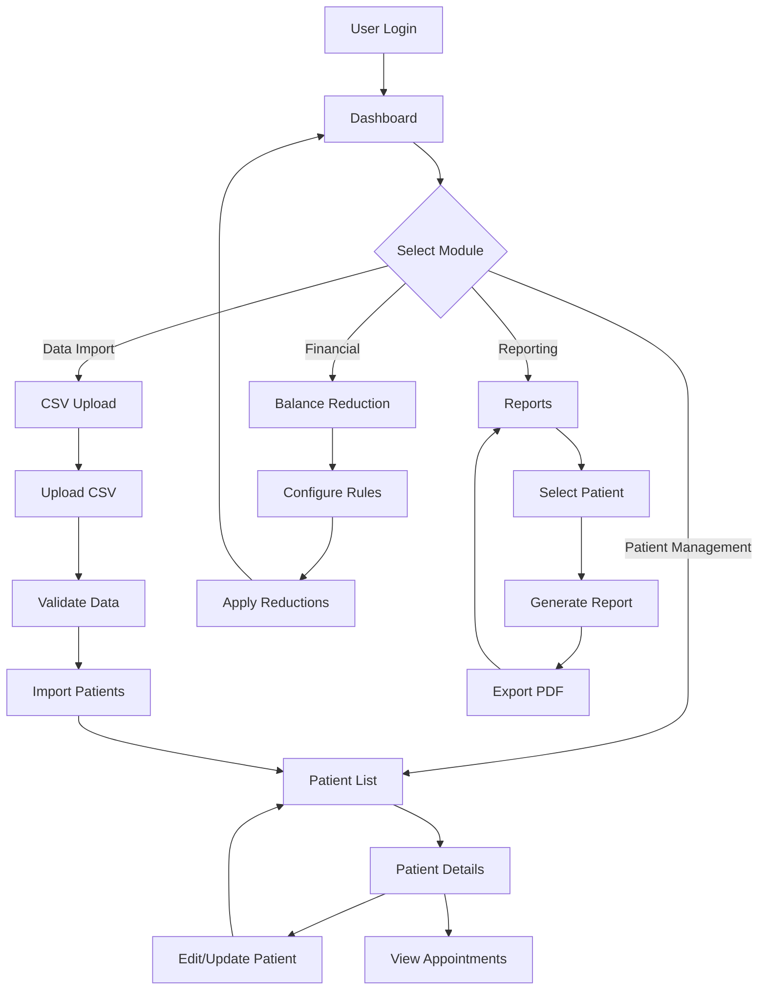

# Medical Practice Management System - Complete Documentation

## System Overview

A comprehensive medical practice management system built with React, TypeScript, and Tailwind CSS, featuring patient management, financial tracking, and reporting capabilities.

---

## Module Documentation

### 1. Authentication Module

#### Login Screen (`LoginForm.tsx`)
**Purpose**: Secure user authentication and session management

**UI Design Features**:
- Clean, centered login form with medical-themed hero image
- Username and password input fields with validation
- Prominent "Sign In" button with loading states
- Professional medical branding with blue color scheme
- Responsive design for all device sizes

**Functionality**:
- User credential validation
- Session management
- Error handling for invalid credentials
- Redirect to dashboard upon successful login

**Navigation Flow**: 
```
Login → Dashboard (on successful authentication)
```

---

### 2. Dashboard Module

#### Main Dashboard (`Dashboard.tsx`)
**Purpose**: Central navigation hub and system overview

**UI Design Features**:
- Grid layout with feature cards
- Medical-themed icons for each module
- Quick access buttons with hover effects
- Professional color scheme with primary blue accents
- Responsive card layout adapting to screen size

**Feature Cards**:
1. **Patient Management** - Users icon, green accent
2. **CSV Upload** - Upload icon, orange accent  
3. **Balance Reduction** - Calculator icon, pink accent
4. **Reports** - FileText icon, teal accent

**Functionality**:
- Navigation to all system modules
- Quick overview of available features
- User session display
- Responsive navigation menu

**Navigation Flow**:
```
Dashboard → Patient List
Dashboard → CSV Upload  
Dashboard → Balance Reduction Management
Dashboard → Reports
```

---

### 3. Patient Management Module

#### Patient List (`PatientList.tsx`)
**Purpose**: View and manage all patients in the system

**UI Design Features**:
- Data table with sortable columns
- Search and filter functionality
- Action buttons for each patient row
- Professional table styling with hover effects
- Pagination for large datasets

**Table Columns**:
- Patient ID
- Full Name
- Date of Birth
- Contact Information
- Account Balance
- Actions (View Details, Edit)

**Functionality**:
- Patient search and filtering
- Quick navigation to patient details
- Bulk operations support
- Export capabilities

#### Patient Detailed Info (`PatientDetailedInfo.tsx`)
**Purpose**: Comprehensive patient profile and history management

**UI Design Features**:
- Tabbed interface for organized information
- Card-based layout for different data sections
- Form inputs with validation styling
- Progress indicators for appointments
- Color-coded status badges

**Information Sections**:
1. **Personal Information**
   - Basic demographics
   - Contact details
   - Address information

2. **Medical Information**
   - Medical history
   - Current conditions
   - Allergies and medications

3. **Appointment History**
   - Chronological appointment list
   - Service provider details
   - Treatment information
   - Financial details

4. **Account Balance**
   - Current balance display
   - Payment history
   - Reduction tracking

**Functionality**:
- Edit patient information
- Add new appointments
- View detailed appointment history
- Track account balances
- Generate patient-specific reports

**Navigation Flow**:
```
Patient List → Patient Details
Patient Details → Edit Information
Patient Details → Add Appointment
Patient Details → View History
```

---

### 4. Data Import Module

#### CSV Upload (`CSVUpload.tsx`)
**Purpose**: Bulk import patient data from CSV files

**UI Design Features**:
- Drag-and-drop upload area
- File validation indicators
- Progress bars for upload status
- Error reporting with detailed messages
- Preview table for imported data

**Upload Process**:
1. File selection/drag-drop
2. Format validation
3. Data preview
4. Import confirmation
5. Success/error reporting

**Functionality**:
- CSV file parsing and validation
- Bulk patient data import
- Error handling and reporting
- Data preview before import
- Rollback capabilities for failed imports

**Navigation Flow**:
```
Dashboard → CSV Upload
CSV Upload → Data Preview
Data Preview → Import Confirmation
Import Success → Patient List
```

---

### 5. Financial Management Module

#### Balance Reduction Management (`BalanceReductionManagement.tsx`)
**Purpose**: Manage patient account balance reductions and financial rules

**UI Design Features**:
- Configuration panels for reduction rules
- Patient selection interfaces
- Calculation preview tables
- Financial summary cards
- Progress tracking for bulk operations

**Key Features**:
1. **Reduction Rules Configuration**
   - Percentage-based reductions
   - Fixed amount reductions
   - Provider-specific rules
   - Date range applications

2. **Patient Selection**
   - Individual patient selection
   - Bulk selection capabilities
   - Filter-based selection
   - Preview of affected accounts

3. **Application Process**
   - Preview calculations
   - Confirmation workflows
   - Batch processing
   - Results reporting

**Functionality**:
- Create and manage reduction rules
- Apply reductions to patient accounts
- Track reduction history
- Generate financial reports
- Audit trail maintenance

**Navigation Flow**:
```
Dashboard → Balance Reduction Management
Balance Reduction → Configure Rules
Balance Reduction → Select Patients
Balance Reduction → Preview Changes
Balance Reduction → Apply Reductions
```

---

### 6. Reporting Module

#### Reports (`Reports.tsx`)
**Purpose**: Generate comprehensive patient and financial reports

**UI Design Features**:
- Excel-style table layout with borders
- Provider-wise grouping sections
- Color-coded status indicators
- Professional report formatting
- Export functionality with loading states

**Report Structure**:
1. **Patient Information Section**
   - Personal details grid
   - Contact information
   - Account summary

2. **Account Balance Summary**
   - Current balance display
   - Total appointments count
   - Financial overview

3. **Provider-wise Appointment History**
   - Excel-style table layout
   - Grouped by service provider
   - Detailed appointment information
   - Financial calculations

**Table Columns**:
- Service Provider Name
- Treatment Details
- Appointment Date
- Current Balance
- Final Balance (with reduction %)
- Status (with color-coded badges)
- Case Progress (with completion %)

**Summary Features**:
- Provider subtotals
- Grand total calculations
- Status distribution
- Progress tracking

**Functionality**:
- Patient selection for reports
- Comprehensive report generation
- PDF export capabilities
- Provider-wise data grouping
- Financial summaries and calculations

**Navigation Flow**:
```
Dashboard → Reports
Reports → Select Patient
Reports → Generate Report
Reports → Export PDF
```

---

## Technical Architecture

### Frontend Stack
- **React 18** - Component-based UI framework
- **TypeScript** - Type-safe development
- **Tailwind CSS** - Utility-first styling
- **Vite** - Fast build tool and dev server

### UI Components
- **Shadcn/UI** - Professional component library
- **Lucide React** - Consistent icon system
- **Radix UI** - Accessible primitives

### Design System
- **Semantic color tokens** - Consistent theming
- **Responsive design** - Mobile-first approach
- **Accessibility** - WCAG compliant components
- **Professional medical theme** - Healthcare-appropriate styling

### Key Design Patterns
- **Card-based layouts** - Information organization
- **Table interfaces** - Data presentation
- **Form validation** - User input handling
- **Loading states** - User feedback
- **Error handling** - Graceful failure management

---

## User Workflow Summary



## System Benefits

### For Healthcare Providers
- Streamlined patient management
- Automated financial calculations
- Comprehensive reporting capabilities
- Efficient data import processes

### For Administrative Staff
- Intuitive user interface
- Bulk operation capabilities
- Detailed audit trails
- Professional report generation

### For Management
- Financial oversight tools
- Performance tracking
- Compliance reporting
- Data-driven insights

---

## Future Enhancement Opportunities

1. **Integration Capabilities**
   - EMR system connections
   - Payment gateway integration
   - Insurance verification APIs

2. **Advanced Features**
   - Automated appointment scheduling
   - Patient communication tools
   - Advanced analytics dashboard

3. **Mobile Applications**
   - Native mobile apps
   - Offline capabilities
   - Push notifications

4. **Security Enhancements**
   - Two-factor authentication
   - Role-based access control
   - HIPAA compliance features

---

*This documentation provides a comprehensive overview of the Medical Practice Management System, detailing each module's functionality, UI design, and user workflows.*